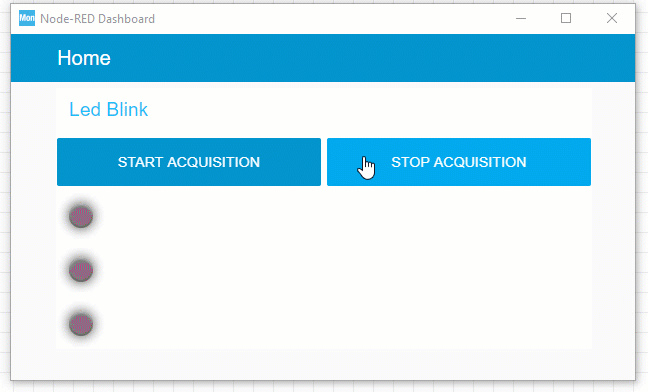

# LED Blink Example
On STM32F7 Discovery board, there are three LED's LD1, LD2 and LD3.  
LD1 is Red LED and is connected to PJ13 pin of the micro-controller.  
While LD2 is Green LED and is connected to PJ5 pin of the micro-controller.  
And LD3 is also Green LED and is connected to PA12 pin of the micro-controller.  

**NOTE: To save space consumption on GitHub, `Project Manager ` setting is selected as to `Add necessary library files as referen in the toolchain project configuration file`  
So, to use this example, please make sure to select the correct setting.**  

Development Environment: STM32CubeIDE 1.6.1, STM32CubeMX 6.1.2, STM32CubeMonior 1.1.0  
STM32Cube MCU Package for STM32F7 Series Version 1.16.1  

#### Led Blink Using HCL_GetTick and Using External Interrupt Event
The drawback of the cure delay is that this blocks the CPU time for doing other tasks, this example, uses ```HAL_GetTick()``` function, so execute the individual Led On-Off Tasks, this method is non-blocking in nature.  

The project is also configured to generate interrupt whenever there is a rising edge on pin PA0, which is connected to Blue Button.  
Whenever this interrupt is triggered, a variable is set, which is used to toggle the state of LD3.  

The following is the gif image of the working demo, which is prepared using CubeMonitor Software.  

